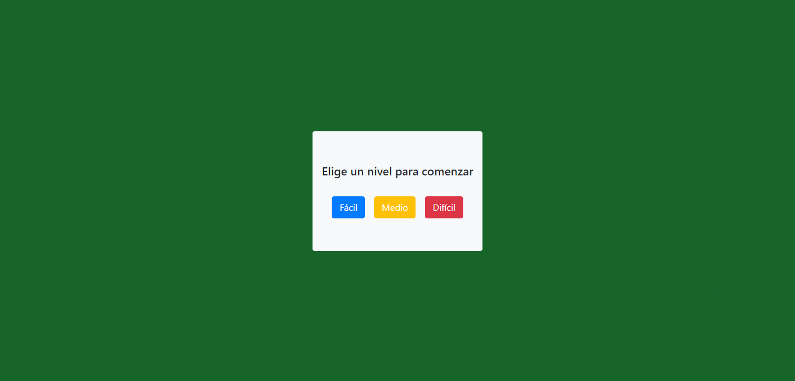

# Cards memory

## Instrucciones

Para iniciar entra a este link: [Cards Memory](https://melyhc.github.io/cards-memory/)

### 1. Seleciona el nivel que quieres jugar (fácil, medio, difícil)

En cada uno de los niveles aumentará la dificultad con 8, 16 0 32 cartas sobre la mesa.

### 2. Empezar el juego

Tendrás que encontrar la pareja de cada carta, se consideran pareja a las cartas con el mismo número y tipo/palo.

Tendrás en la parte superior derecha tendrás un contador con la cantidad de veces que volteas cada pareja.

Podrás resetear el juego, pero ojo tendrás que volver a elegir el nivel.

### 3. Ganar

Para ganar encuentra todas las parejas.

Cuando esten todas las cartas enparejadas aparecerá un mensaje indicando cuantos intentos te tomo resolver el nivel y podrás volver a empezar.

## Si clonas este repositorio

Si quieres puedes hacerle tus propias modificaciones al código, el framework que utilice es React.js.

Recuerda hacer un: 

~~~
npm install
~~~

Para descargar las dependencias necesarias para que se ejecute el código.

Y depués de descargar todas la dependencias ejecuta: 

~~~
npm start
~~~

Para correr el código.

Para editar el código entra a src y en App.js encotrarás todas las funciones utilizadas.